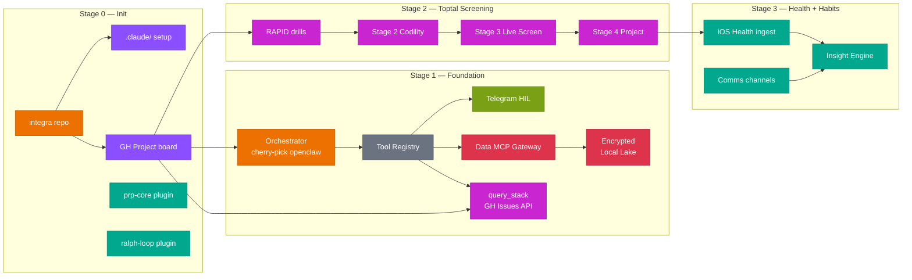
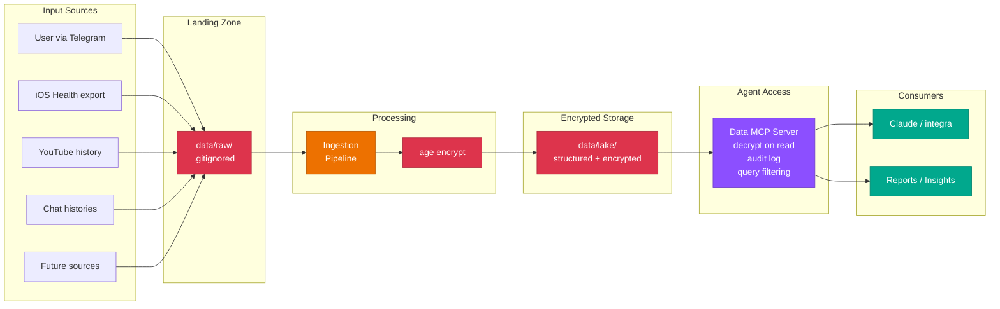
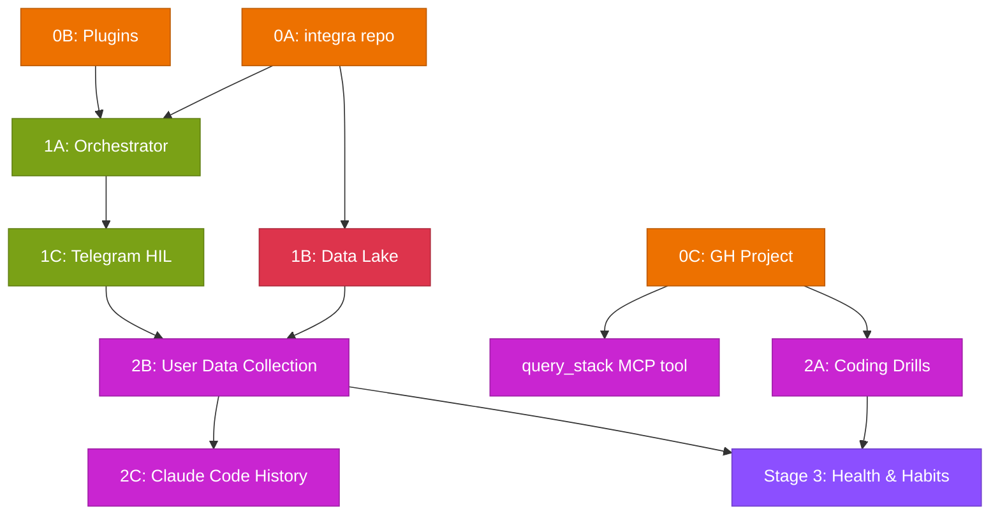

# Integra — Initialization Roadmap

> Master/orchestrator agent evolved from openclaw-config.
> Primary goal: get into Toptal, land first project, improve life health in a journey.

---

## 1. Pruning Log

Items from INSTRUCTION.md — merged, deferred, or inlined to eliminate overlap and low-gain work.

| Original Item | Action | Rationale |
|---------------|--------|-----------|
| "openclawd setup" + "integra init" | **MERGE** → Stage 0 | Same deliverable |
| "decide data grouping" + "secure intake" | **MERGE** → Stage 1 data lake | Same concern |
| "industry patterns" + "coleman00 patterns" | **MERGE** → architecture principle | Not a stage; applied everywhere |
| "insights from claude code history" | **DEFER** → post-Stage 2 | Revisit after data lake + deps operational. Requires drug interrogation data first. |
| "train/improve human context" | **DEFER** → post-MVP | Depends on data pipeline maturity |
| matplotlib/sns plots | **DEFER** → when data exists | No data to visualize yet |
| "schedule drug/supplement interrogation" | **INLINE** → Stage 2B data collection | One task within user data collection |
| "user email addresses" | **INLINE** → integra config | Configuration, not a stage |
| "extend user data inputs" | **ARCHITECTURE** → extensible ingestion | Pattern handles future inputs |
| "readable plan format" | **META** → this document | Formatting concern, not deliverable |
| WhatsApp/SMS/email sending | **DEFER** → Stage 3 | Telegram HIL is day-1; others post-MVP |
| iOS Health / YouTube history | **DEFER** → Stage 3 | Depends on data lake being operational |

**Net result**: 12 line items → 4 stages, 3 parallel tracks.

---

## 2. Architecture Overview



---

## 3. Secured Local Data Lake Pattern

All user sensitive data flows through one pattern: **Land → Encrypt → Serve via MCP**.



**Key properties:**
- Raw data never enters git — `.gitignored` landing zone
- Encryption at rest via `age` (modern, simple, no GPG complexity)
- Agent never sees raw files — queries through MCP tools only
- MCP server returns filtered, minimal data (need-to-know principle)
- Audit log tracks: what data, when, which agent session
- Pattern is source-agnostic — new input types add an ingestion adapter, nothing else changes

**MCP tools exposed to agent:**

| Tool | Purpose | Returns |
|------|---------|---------|
| `ingest_data` | Trigger ingestion from landing zone to encrypted lake | Status + record count |
| `query_data` | Query any ingested data category (health, habits, history) | Filtered records |
| `query_stack` | Compute task/quest scores from GH Issues by label + date range | Day/week/total stack breakdown |

- `ingest_data` + `query_data` operate on the encrypted local data lake (Stage 1B)
- `query_stack` operates on GH Issues API (Stage 2B, after task/quest labels exist)

Additional tools added post-MVP as data sources grow.

---

## 4. Task/Quest Pattern

All work and behavior tracking follows one universal pattern. Used for scoring, coaching, and habit management.

### Task Classification

Every task has two axes:

| Axis | Values | Meaning |
|------|--------|---------|
| **Origin** | `planned` / `user-request` / `choice` | How the task was created |
| **Nature** | `job` / `reward` | What kind of task |

**Origin types:**
- `planned` — from roadmap/sprint, exists before user acts
- `user-request` — user asks integra to do something ad-hoc
- `choice` — integra presents options, user picks (questionnaire-driven)

### Scoring: Outcome-Based

```
score = base (pass/fail) + bonus (quality gates passed)

base  = 0 (failed) | 1 (completed)
bonus = +1 per quality gate passed (tests green, review approved, time target met, etc.)
```

No fixed difficulty points. Score reflects **outcome quality**, not estimated effort.

### Reward Task Categories

Tracked daily. All sensitive data encrypted in data lake.

| Category | Type | Tracking | Sensitive |
|----------|------|----------|-----------|
| Exercise / sleep / hydration | healthy | Binary + duration | No |
| Supplement/medication compliance | healthy | On-schedule yes/no | Yes |
| Coding practice (RAPID drills) | healthy | Problem count + time | No |
| Learning (docs, videos, courses) | healthy | Duration + source | No |
| YouTube consumption | neutral | Duration | No |
| Gaming — mobile (Royal Match, ~10min) | quota | Session count + duration | No |
| Gaming — desktop (WoW, ~1-3h) | quota | Session count + duration | No |
| Porn | quota | Duration | Yes |
| 3-CMC | addiction-therapy | Amount + time, **decreasing quota** | Yes |
| K (tip-touch amount) | addiction-therapy | Amount + time | Yes |

**Quota mechanic**: `addiction-therapy` and `quota` categories have a **target ceiling that decreases over time**. Integra tracks actual vs. quota and coaches toward reduction.

```
quota_week_n = quota_week_0 × decay_factor^n
actual vs quota → score adjustment
  under quota = bonus +1
  at quota    = base only
  over quota  = score 0 + coaching flag
```

### Stack = Sum Metric

Three granularities, computed per origin, per nature, or combined:

| Level | Scope | Use |
|-------|-------|-----|
| `stack_day` | Today's completed tasks | Daily accountability |
| `stack_week` | This week (Mon–Sun) | Weekly trend |
| `stack_total` | All time | Progress trajectory |

**Stack breakdown example:**
```
Day 2026-02-28:
  job:     3 tasks, score 7  (2 base + 5 bonus)
  reward:  5 tasks, score 4  (4 healthy + 1 under-quota bonus)
  total:   8 tasks, score 11

Week 2026-W09:
  job:     12 tasks, score 28
  reward:  31 tasks, score 22
  total:   43 tasks, score 50
```

### Architecture: GH Issues + Labels + MCP

Tasks are GH issues in the integra repo. Labels encode classification:

| Label prefix | Values | Example |
|-------------|--------|---------|
| `origin:` | `planned`, `user-request`, `choice` | `origin:planned` |
| `nature:` | `job`, `reward` | `nature:reward` |
| `category:` | `healthy`, `quota`, `addiction-therapy`, `neutral` | `category:quota` |
| `score:` | numeric | `score:3` |

MCP tool `query_stack` computes stacks by querying GH API:
- Filter by labels, closed date range
- Sum scores by grouping
- Return day/week/total breakdown

No custom DB needed. GH Issues are the source of truth.

---

## 5. Stage Breakdown

### Stage 0 — Parallel Init (Day 1)

Three independent tracks, all parallelizable.

| Track | Tasks | Dependency | Owner |
|-------|-------|------------|-------|
| **0A: Repo** | Create `bprzybysz/integra` repo, init structure, CLAUDE.md, .gitignore | None | integra |
| **0B: Plugins** | Install `prp-core` + `ralph-loop` globally (`~/.claude/plugins/`), verify commands work in any project | None | user |
| **0C: GH Project** | Create project board, define sprint columns, link to integra repo | None | integra |

**Quality gate**: `gh project list` shows board, `/prp-core-create` responds, `integra/CLAUDE.md` exists.

**Parallel execution diagram:**

```mermaid
gantt
    title Stage 0 — Parallel Init
    dateFormat X
    axisFormat %s

    section Track 0A
    Create integra repo + scaffold     :a1, 0, 2
    Write CLAUDE.md + .claude/         :a2, 2, 4

    section Track 0B
    Install prp-core plugin            :b1, 0, 1
    Install ralph-loop plugin          :b2, 1, 2
    Verify commands + test run         :b3, 2, 4

    section Track 0C
    Create GH Project board            :c1, 0, 1
    Define sprint columns + labels     :c2, 1, 3
    Link repos + verify e2e           :c3, 3, 4
```



---

### Stage 1 — Foundation Sprint (Days 2–4)

Two parallel tracks + one sequential.

| Track | Tasks | Dependency | Owner |
|-------|-------|------------|-------|
| **1A: Orchestrator** | Cherry-pick orchestrator.py, registry.py, config.py from openclaw. Rename openclaw→integra. Async Anthropic client. Code-level HIL enforcement. | Stage 0A | integra |
| **1B: Data Lake** | Create data/ structure, age encryption setup, ingestion pipeline scaffold, Data MCP server (2 tools: `ingest_data`, `query_data`). `query_stack` added in Stage 2B when task/quest labels exist. | Stage 0A | integra |
| **1C: Telegram HIL** | Cherry-pick telegram_hil.py, verify approval flow works, connect to orchestrator. | 1A | integra |

**Quality gate**: `uv run pytest tests/ -v` passes, Telegram bot responds to `/start`, `age -d data/lake/test.age` decrypts, MCP server responds to `query_data`.

**Cherry-pick manifest from openclaw-config:**

| Source File | Target | Changes |
|-------------|--------|---------|
| `openclaw/orchestrator.py` | `integra/core/orchestrator.py` | Rename, async client, strip sync wrapper |
| `openclaw/tools/registry.py` | `integra/core/registry.py` | Add `requires_confirmation` flag per tool |
| `openclaw/config.py` | `integra/core/config.py` | Rename, add data lake paths |
| `openclaw/tools/telegram_hil.py` | `integra/integrations/telegram.py` | Keep as-is, it works |
| `openclaw/app.py` | `integra/app.py` | Strip voice routes (defer), add MCP mount |

**Not cherry-picked**: `gmail.py`, `gcalendar.py`, `gdrive.py`, `voice.py`, `tts.py`, `google_auth.py` — all Stage 3 (comms channels).

---

### Stage 2 — Toptal Screening Sprint (Days 5–21)

The actual goal. Two parallel tracks.

| Track | Tasks | Dependency | Owner |
|-------|-------|------------|-------|
| **2A: Coding Drills** | RAPID framework practice (15 patterns × 5 problems each), timed sessions, progress tracking via GH Project issues. | Stage 0C (GH Project for tracking) | **user** |
| **2B: User Data Collection** | Collect drugs/supplements/dietary via Telegram bot questionnaire, ingest to data lake, structured as queryable records. Includes scheduled drug/supplement interrogation. | Stage 1C (Telegram HIL) + Stage 1B (Data Lake) | integra |
| **2C: Claude Code History** | Reanalyse CC session data after data lake + deps operational. Data already exists: `interviews/toptal/data/claude-history-all.zip.part-a{a,b,c}` (encrypted, split). Scripts exist: `interviews/toptal/scripts/extract_prompts.py`, `visualize_prompts.py`. Charts exist: `interviews/toptal/charts/` (9 PNGs). User provides `age` secret key at ingestion time. Cross-reference with drug/supplement schedule from 2B. | 2B complete + user provides decryption key | integra |

**Quality gate**: 75 problems solved, pattern recognition >80% accuracy, all user health data ingested and queryable, claude code history analysis queued.

**Toptal screening stage mapping:**

| Toptal Stage | Prep Duration | Key Deliverable | Risk |
|--------------|---------------|-----------------|------|
| Stage 1: Language & Personality | 1 day | 60-sec intro script, "Why Toptal" answer | LOW |
| Stage 2: Codility (90 min, 3 problems) | 1–2 weeks | 75 problems done, RAPID fluent | MEDIUM |
| Stage 3: Live Screen (60 min, 2 problems) | 1 week overlap | Mock sessions, talk-through drill | HIGH |
| Stage 4: Test Project (1–3 weeks) | Planned in pre-stage | PRP for take-home, TDD scaffold | LOW |

---

### Stage 3 — Health & Habits (Post-MVP, lazy-planned)

Planned at pre-stage level only. Details deferred to PRP generation when Stage 2 gate passes.

| Track | Scope | Pre-stage PRP needed |
|-------|-------|---------------------|
| **3A: Health Data Pipeline** | iOS Health export, YouTube history, chat histories. Encrypted archive already at `interviews/toptal/data/allsecretdata.zip.part-a{a,b,c}` — user provides decryption key. | Yes — data schema + ingestion adapters |
| **3B: Communication Channels** | Gmail send, WhatsApp (Twilio), SMS (Twilio), email notifications | Yes — channel priority + approval rules |
| **3C: Insight Engine** | Pattern detection in health data, habit correlation, CC history productivity insights (builds on 2C) | Yes — ML/statistical approach + privacy constraints |

**Quality gate**: Defined per-PRP at pre-stage planning time.

---

## 6. Dependency Graph



**Critical path**: 0A → 1A → 1C → 2B → 2C (data collection → drug interrogation → claude code history)
**Parallel path**: 0C → 2A (coding drills run independently, time-dominant activity)

---

## 7. integra Project Structure (Target)

```
integra/
├── CLAUDE.md                          # Project rules, validation commands, architecture notes
├── pyproject.toml                     # uv, ruff, mypy, pytest
├── .claude/
│   ├── commands/
│   │   └── ingest-data.md             # Custom: trigger data ingestion
│   ├── hooks/
│   │   └── format-after-edit.sh       # ruff format + ruff check --fix
│   └── settings.local.json            # Permissions, MCP servers
├── integra/
│   ├── __init__.py
│   ├── app.py                         # FastAPI entrypoint
│   ├── core/
│   │   ├── orchestrator.py            # Claude agentic loop (async)
│   │   ├── registry.py                # Tool schemas + dispatch + HIL flags
│   │   └── config.py                  # Pydantic-settings
│   ├── integrations/
│   │   └── telegram.py                # HIL confirm/notify
│   └── data/
│       ├── mcp_server.py              # Data MCP gateway
│       ├── ingestion.py               # Raw → structured pipeline
│       └── encryption.py              # age encrypt/decrypt helpers
├── data/                              # .gitignored
│   ├── raw/                           # Landing zone (unencrypted, transient)
│   ├── lake/                          # Encrypted structured storage
│   └── audit/                         # Access logs
└── tests/
    ├── test_orchestrator.py
    ├── test_registry.py
    ├── test_data_mcp.py
    └── test_telegram.py
```

> PRP commands (`/prp-core-create`, `/prp-core-execute`, etc.) provided by the globally-installed `prp-core` plugin — no local files needed. Agents and PRPs/ directories created by the plugin on first use. `examples/` deferred until there's real code to pattern-match.

---

## 8. GH Project Sprint Structure

| Sprint | Name | Duration | Contains |
|--------|------|----------|----------|
| Sprint 0 | Init | 1 day | 0A + 0B + 0C (all parallel) |
| Sprint 1 | Foundation | 3 days | 1A + 1B parallel, then 1C |
| Sprint 2 | Toptal Prep | 2 weeks | 2A (user) + 2B (integra) parallel |
| Sprint 3+ | Health & Habits | TBD | Lazy-planned, PRP-driven |

**GH Project columns**: `Backlog` → `Sprint N` → `In Progress` → `Review` → `Done`

**Labels**:
- Stages: `stage-0`, `stage-1`, `stage-2`, `stage-3`
- Ownership: `user-task`, `integra-task`
- Status: `blocked`, `data-sensitive`
- Task/Quest: `origin:planned`, `origin:user-request`, `origin:choice`, `nature:job`, `nature:reward`, `category:healthy`, `category:quota`, `category:addiction-therapy`, `category:neutral`, `score:N`

---

## 9. Quality Gates Summary

| Gate | Stage | Criteria | Automated? |
|------|-------|----------|------------|
| G0 | Stage 0 | Repo exists, plugins respond, GH Project has columns | Manual verify |
| G1-code | Stage 1 | `uv run pytest tests/ -v` all pass, `ruff check` clean, `mypy .` clean | Yes |
| G1-hil | Stage 1 | Telegram bot sends approval request, user can approve/deny, result propagates | Manual + integration test |
| G1-data | Stage 1 | `age -d` decrypts test data, MCP `query_data` returns results | Integration test |
| G2-drill | Stage 2 | 75 problems solved, pattern accuracy >80%, 7/10 Easy under 15 min | User self-report |
| G2-data | Stage 2 | All user health data ingested, queryable via MCP, audit log populated | Integration test |
| G2-quest | Stage 2 | `query_stack` returns correct day/week/total for test issues with task/quest labels. At least one `addiction-therapy` quota verified with decay calculation. | Integration test |
| G3-pre | Stage 3 | PRP generated with confidence >7/10 for each Stage 3 track | PRP score |

---

## 10. Plugin Setup + Cheatsheet

**Install** (one-time, ~5 min total):
1. Install `prp-core` + `ralph-loop` plugins globally
2. Delete manual `generate-prp.md` / `execute-prp.md` from 4 existing CE projects (plugin replaces them)
3. Domain-specific agents, hooks, rules.md stay untouched

### Command cheatsheet

```
# PRP workflow (via prp-core plugin)
/prp-core-create "feature description"    # Generate PRP
/prp-core-execute                          # Execute PRP with validation
/prp-core-run-all                          # Full pipeline: create → execute → commit → PR
/prp-prd                                   # Generate PRD only
/prp-plan                                  # Generate plan from PRD
/prp-implement                             # Implement from plan
/prp-commit                                # Commit with conventional message
/prp-pr                                    # Create PR from branch
/prp-review                                # Review current changes
/prp-debug                                 # Investigate + fix issue
/prp-issue-investigate                     # Deep investigation
/prp-issue-fix                             # Fix from investigation

# Ralph loop (via ralph-loop plugin)
/ralph-loop "task. Output <promise>DONE</promise> when complete." \
  --completion-promise "DONE" --max-iterations 30
/cancel-ralph                              # Stop active loop

# Workflow: PRP + Ralph (autonomous feature)
/prp-core-create "feature"                 # Step 1: generate PRP
# Review PRP, approve                      # Step 2: human gate
/prp-ralph                                 # Step 3: autonomous execution with ralph loop
```

---

## Vocabulary

| Term | Definition |
|------|------------|
| **integra** | Master/orchestrator agent replacing openclaw. FastAPI + Claude Opus 4.6. |
| **PRP** | Product Requirements Prompt — implementation blueprint for AI agents (PRD + codebase context + validation gates). |
| **Ralph loop** | Autonomous execution loop via Claude Code stop-hook. Retries until completion promise or max iterations. |
| **Skinner harness** | Full agent control plane: deterministic tool-use lanes, circuit breakers, identity attribution. Post-MVP goal. |
| **HIL** | Human-in-the-Loop — Telegram-based approval flow for sensitive/irreversible actions. |
| **Data MCP** | MCP server mediating agent access to encrypted user data. Decrypt-on-read, audit, query filtering. |
| **age** | Modern file encryption tool (age-encryption.org). Simpler than GPG, no key servers. |
| **Landing zone** | Unencrypted transient area where raw user data is deposited before ingestion. |
| **Quality gate** | Automated or manual checkpoint that must pass before progressing to next stage. |
| **PIV** | Plan → Implement → Validate. Core workflow loop from context engineering methodology. |
| **CE** | Context Engineering — methodology for structuring AI agent inputs to maximize one-pass success. |
| **prp-core** | Claude Code plugin providing PRP workflow commands (generate, execute, commit, PR, review). |
| **ralph-loop** | Claude Code plugin providing autonomous execution loops via stop-hook mechanism. |
| **RAPID** | Read & Restate → Assess Pattern → Plan in Pseudocode → Implement → Debug. 0-shot coding protocol from speed-diagnosis.md. |
| **Stack** | Sum metric of task scores. Computed per day/week/total, grouped by origin and/or nature. |
| **Quota** | Decreasing ceiling for tracked behaviors (gaming, substances). `quota_week_n = quota_week_0 × decay^n`. Under quota = bonus. |
| **Origin** | How a task was created: `planned` (roadmap), `user-request` (ad-hoc), `choice` (picked from options). |
| **Nature** | What kind of task: `job` (scored work) or `reward` (behavior tracking). |
| **query_stack** | MCP tool that queries GH Issues by label + date range to compute stack scores. |
